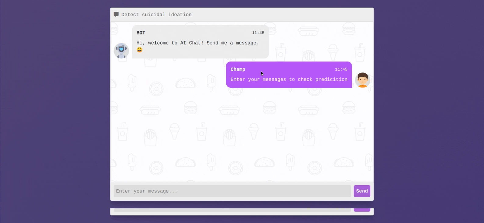
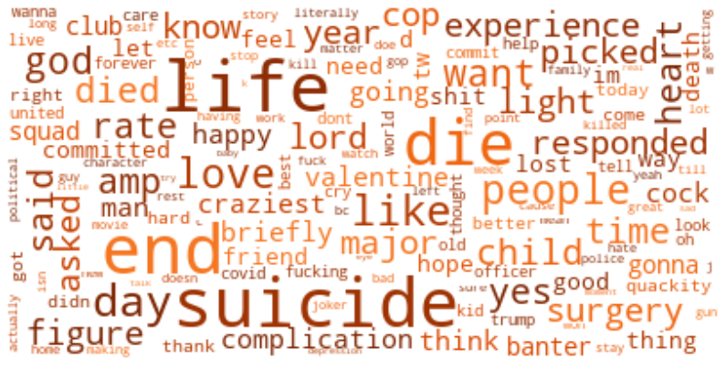
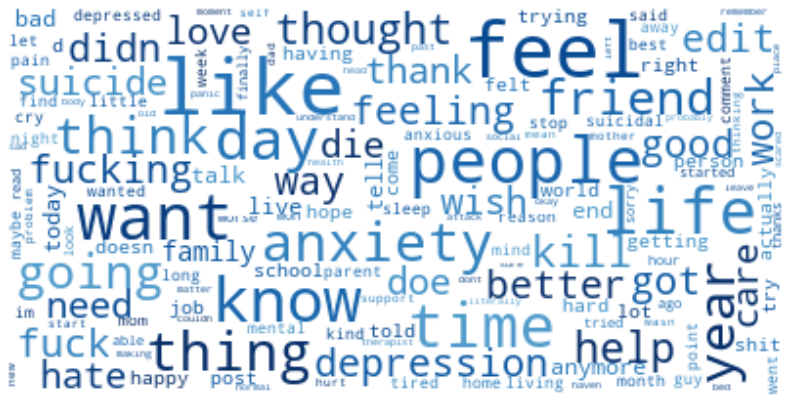

<div align="center">


<br/>


</div>

---

## 🧠 About The Project

**MindSafe AI** is an AI-powered system for detecting suicidal ideation in online social content. With the rapid growth of social media, individuals increasingly express mental health struggles in online communities — often anonymously. This project applies **Natural Language Processing (NLP)**, **Machine Learning**, and **Deep Learning** to automatically identify posts and messages that may reflect suicidal intent, with the goal of enabling early intervention and saving lives.

The system analyzes posts from **Reddit** and **Twitter**, and classifies them using a dual-model ensemble approach combining a Random Forest classifier and a Bidirectional LSTM deep learning model.

<div align="center">
  
</div>

---

## 📊 Datasets

Two datasets were collected and used for training:

| Source  | Suicidal Samples | Non-Suicidal Samples |
|---------|-----------------|----------------------|
| Reddit  | 2,958           | 5,381                |
| Twitter | 3,000           | —                    |

- **Reddit** data was scraped from subreddits such as `r/SuicideWatch`, `r/depression`, `r/anxiety`, etc.
- **Twitter** data was collected by querying crisis-related keywords like `"end my life"`, `"want to die"`, etc.

**Word Clouds — Twitter (left) vs Reddit (right):**

<div align="center">
  
  &nbsp;&nbsp;
  
</div>

---

## ⚙️ Feature Processing & Training Pipeline

- 🔤 **Text Cleaning**: Removed noise, URLs, special characters, and corpus-specific stopwords.
- ☁️ **Word Cloud Visualization**: Plotted word clouds to identify the most frequent terms per corpus.
- 🧮 **Vectorization**: Applied both **Bag of Words** and **TF-IDF** vectorization schemes.
- 🌲 **Random Forest**: Used GridSearchCV for hyperparameter tuning — achieved **96% accuracy**.
- 🔁 **Bidirectional LSTM**: Trained with **GloVe word embeddings** — achieved **97% accuracy**.

---

## 📈 Results

Performance metrics of the models on the test set:

| Model          | Accuracy | Precision | Recall | F1 Score |
|----------------|----------|-----------|--------|----------|
| RF + TF-IDF    | 0.96     | 0.96      | 0.96   | 0.96     |
| BiLSTM + GloVe | 0.97     | 0.97      | 0.97   | 0.97     |

---

## 🗂️ Project Structure

```
AI_For_Social_Good/
├── Dataset/               # Collected and cleaned datasets
├── Data_Collection/       # Scraping scripts for Reddit & Twitter
├── Src/                   # Text preprocessing & model training notebooks
├── Pretrained_Models/     # Saved models and tokenizers
├── WordClouds/            # Generated word cloud images
├── Flask/                 # Web app (server + frontend)
│   ├── app.py             # Flask application entry point
│   ├── templates/         # HTML templates
│   └── static/            # CSS, JS assets
├── train_sklearn.py       # ML training script
└── create_dataset.py      # Dataset creation utilities
```

---

## 🚀 Getting Started

### Prerequisites

```bash
pip install flask scikit-learn tensorflow numpy pandas nltk
```

### Running the Web App

```bash
cd Flask
python app.py
```

Then open your browser and navigate to `http://127.0.0.1:5000/`

---

## 🛡️ License

Distributed under the **MIT License**. See [`LICENSE`](LICENSE) for more information.

---

<div align="center">

Made with ❤️ for mental health awareness by **Mohammed Mufeed**

*"Technology in service of human well-being."*

</div>
